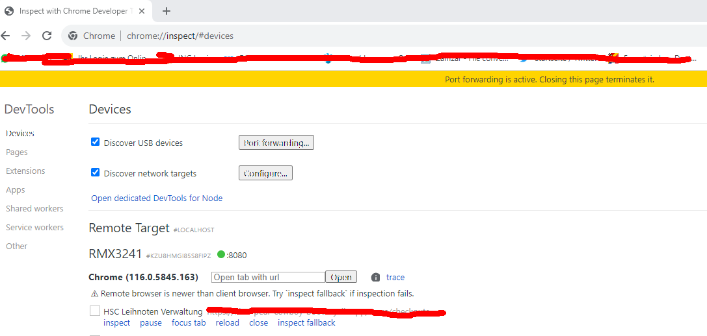
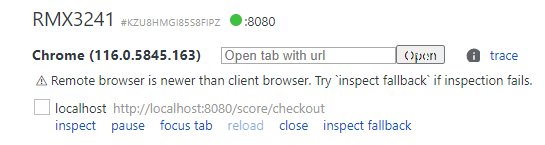
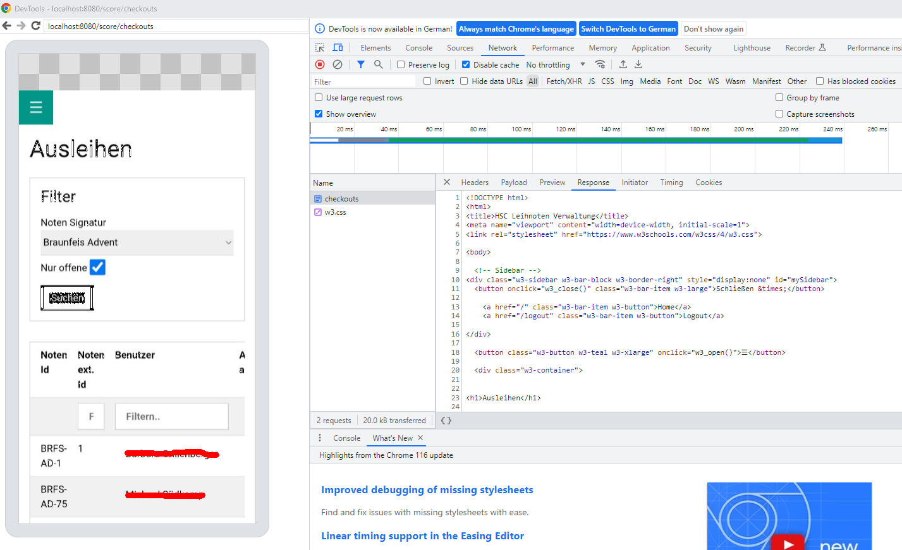

# Development

## Setup project

Recently I had to setup the project again due to a pc change. At the same time the Cyclic host deployment has been abondened.
Also I hadn't touched the development for several months. So maximum hard...
These were the steps to get project running again.

- setup WSL2 and install Ubuntu distro
- download/install nvm: https://github.com/nvm-sh/nvm
- install/use node.js v22 with nvm
- install npm: https://docs.npmjs.com/downloading-and-installing-node-js-and-npm
- clone ScoreRent from GitHub
- npm install
- npm run dev -> MonogoDB error
- create .env file (unfortunately I hadn't backup up my old one - so this caused me extra pain)
  - after creating the MONGODB_URL entry, the app started
  - a "connection refused" to port 587 came up on console - this was from the SMTP connect; however, the app was started
  - forward port 3000
  - http://localhost:3000/login -> Login page
  - Debugging
    - use VSC "debug" link in package.json scripts and choose "npm run dev"
  - Use "password forgotten" function to reset password of admin user
  - configure git user name and email globally

## Remote Android Debugging

- enable USB debugging in Android Dev settings
  . Einstellungen / Zusätzliche Einstellungen / Entwickleroptionen / USB Debugging
- connect device with USB to pc
- URL chrome://inspect/#devices
- the device type should appear on the page
- if not, try
  - reload the inspect page
  - open the inspect page in new tab

### Port forwarding

Allows to run the app on ypur devive against the pc dev environment

- Port: port on device
- IP address and port: adress on the pc
- yellow bar on the top should confirm port porwarding and next to the device name a green dot with port should appear

- run the app on dev pc as usual -> accessible at address configured above
- access the app on device at localhost:\<port\> as configured above

### Debugging

Below your device on the chrome page there is a list of recently opened urls on your device chrome. The app started on the forwarded URL at localhost:\<port\> should be on the list. If not try to refresh the page.

- Next to the URL belonginf to your app click on "inspect"
- a new chrome window will open mirroring the device screen and with Chrome dev tools
  

Happy debugging!
