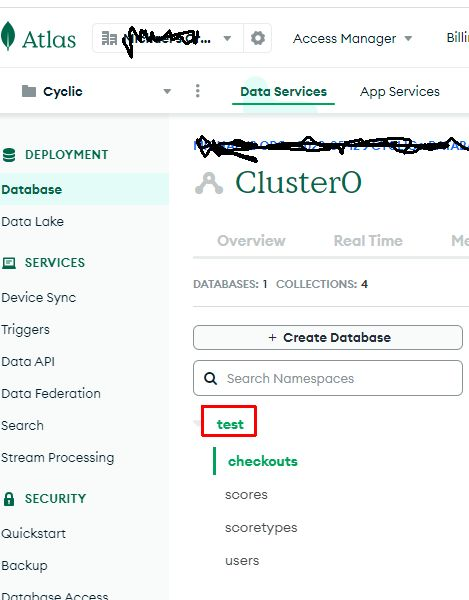

# Mongo db

## Connection string

At the beginning of the app development I was connecting without database name in the URI (see below). I was curiuos what happens if you provide a wrong database name. Astonishingly Mongoose returned no error when connecting. Instead the code which tried to read from a collection just didn't find anything, but again also no error here. I find this a little bizarre.

## Backup & restore

With the free plan of Mongodb Atlas a backup/restore must be done using the cmd line tools mongodump/mongorestore.

## Cmd line line tools

https://www.mongodb.com/docs/database-tools/

### mongodump

creates a binary backup of a database

```
mongodump --uri <connect-url>/<database>
```

- \<connect-url\> is the Mongodb connection string from the env file
- \<database\> is the database to backup

At the beginning I didn't know what the database was, because it didn't appear in the connection URI I've used for quite a while or elsewhere in the Mongoose connection code. I found it here:



So far I've had no other database rather than "test". That's why probably the database could be omitted in the URI. It seems that the database is somehow like a namespace. So unless there are collections of the same name in different databases, one seem to be able to omit the database in the URI. At least this is my understanding. But of course specifying the database in the URI is much more clearer, and from now on I used it in my env variable.

mongodump will by default backup all collections (here: users, scores, ...) into a folder "dump/\<database\>" within the current directory.

I created a shell script mongobackup.sh which runs mongodump and copies the backup to a backuped folder

### mongorestore

restore from a binary backup created with mongodump

The first test you probably want to do is to restore the backup on a different location i.e. database (because you don't want to overwrite your data during this test). It became not immediately clear how to achieve this, but I ended up with this procedure:

- provide the backup in a folder dump/\<target-database\> within your current directory. So e.g. if with mongodump you ended up with a dump/test folder (because "test" is your database name), provide e.g. folder dump/testrestore.
- execute this command

```
mongorestore --uri <connect-url> --dir dump/\<target-database\>
```

It's just that easy. The database "testrestore" will be created if it was not existing.

**Important: don't leave the "test" folder inside the dump, otherwise mongorestore will restore to your "test" database too.**
